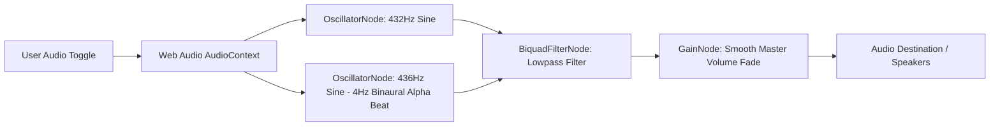

# 🎵 432Hz Audio & Focus Engine Architecture

Backlinks: [[Master View]] • [[Spatial Engine]] • [[Component Map]]

The **Audio & Focus Engine** ([audioEngine.js](file:///Users/neo/nEO-apps/app-3/src/utils/audioEngine.js)) generates real-time 432Hz ambient focus soundscapes using the browser's Web Audio API.

---

## 📻 Why 432Hz Harmonic Tuning?

432Hz is mathematically consistent with the natural resonance frequencies of natural systems and spatial intelligence workflows, promoting calm focus during long mapping sessions.

### Sound Synthesizer Architecture



---

## 👆 Lazy User Gesture Initialization Rule

Modern browsers (Chrome, Safari, Firefox) block audio creation unless initialized following an explicit user gesture (click or keypress).

Nebula V3 implements lazy `AudioContext` initialization:

```javascript
// src/utils/audioEngine.js
class FocusAudioEngine {
  constructor() {
    this.ctx = null;
    this.isPlaying = false;
  }

  init() {
    if (!this.ctx) {
      const AudioCtx = window.AudioContext || window.webkitAudioContext;
      this.ctx = new AudioCtx();
    }
  }

  toggle() {
    this.init();
    if (this.ctx.state === 'suspended') {
      this.ctx.resume();
    }
    if (this.isPlaying) {
      this.stop();
    } else {
      this.start();
    }
  }
}
```

This prevents autoplay policy browser warnings while maintaining smooth user interaction.
