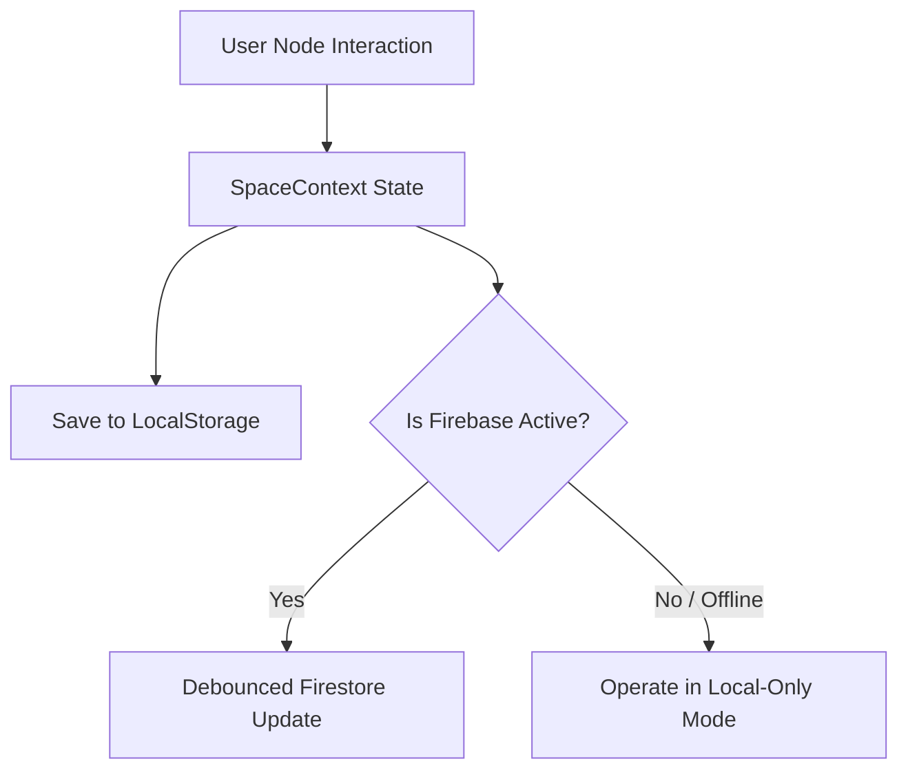

# ☁️ Cloud Sync & Storage Engine Architecture

Backlinks: [[Master View]] • [[Secrets]] • [[Thought Nodes & Tethers]] • [[Component Map]]

The **Cloud Sync Engine** ([SpaceContext.jsx](file:///Users/neo/nEO-apps/app-3/src/context/SpaceContext.jsx)) maintains seamless dual-layer state synchronization between local memory, browser `localStorage`, and Google Cloud Firestore.

---

## ⚡ Firestore Snapshot Jitter Protection

### The Jitter Problem
In real-time multi-client applications, calling `updateDoc` on Firestore triggers an immediate snapshot pushback (`onSnapshot`). When a user drags a card node across the screen, incoming remote snapshot ticks cause card positions to jump or jitter erratically if local user input is overridden.

### The 1.5-Second Local Debounce Solution
Nebula V3 implements `lastLocalEditTimeRef` inside `SpaceContext.jsx`:

```javascript
// src/context/SpaceContext.jsx
const lastLocalEditTimeRef = useRef(0);

useEffect(() => {
  if (!db) return;
  const unsubscribe = onSnapshot(doc(db, 'spaces', 'default-space'), (docSnap) => {
    if (docSnap.exists()) {
      const data = docSnap.data();
      const now = Date.now();
      
      // Ignore incoming cloud snapshots if local edits occurred within 1500ms
      if (now - lastLocalEditTimeRef.current < 1500) {
        return;
      }
      
      if (data.nodes) setNodes(data.nodes);
      if (data.links) setLinks(data.links);
    }
  });
  return () => unsubscribe();
}, []);
```

When local node modifications occur (`moveNodes`, `updateNode`, `createNode`), `lastLocalEditTimeRef.current = Date.now()` is updated immediately, locking local state against snapshot jitter while ensuring smooth 60FPS dragging.

---

## 💾 Dual-Layer Fallback Architecture



### Initial State Recovery Algorithm
1. Check `localStorage.getItem('nebula_nodes')`.
2. If stored data exists and parses clean, initialize state immediately for instant page render.
3. If no local cache exists, load default spatial onboarding template nodes.
4. Establish Firestore `onSnapshot` listener asynchronously without blocking initial render.
